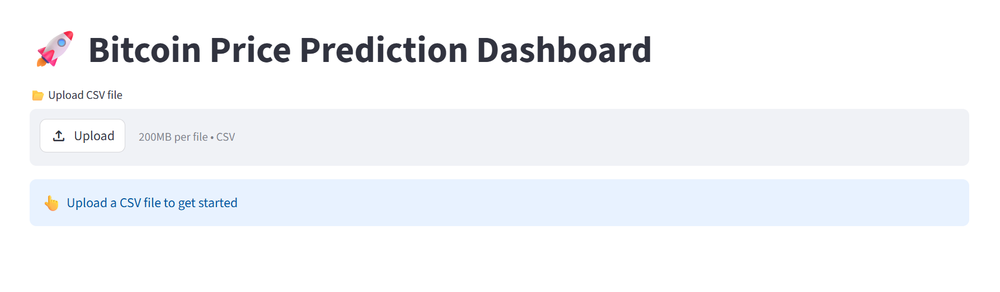
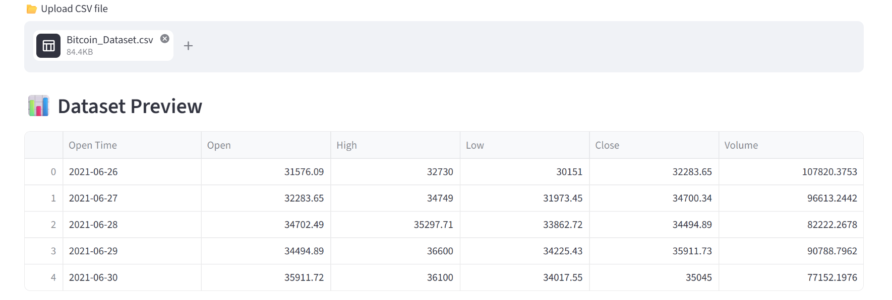
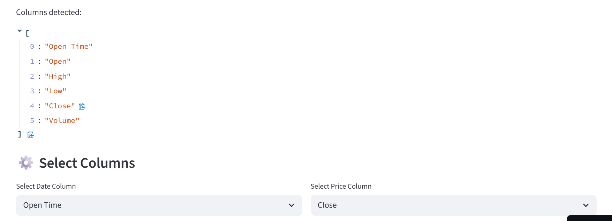
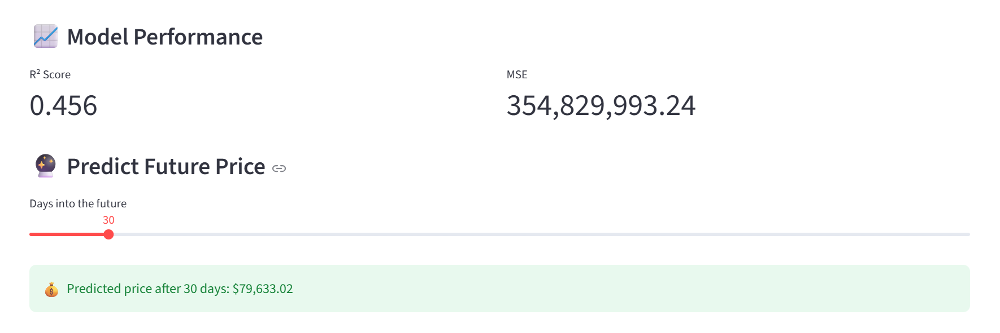
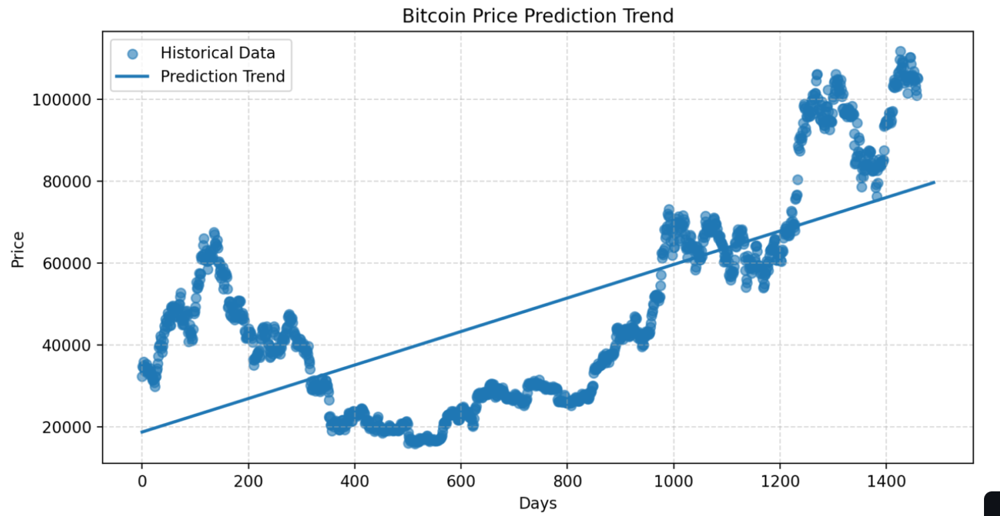

🚀 Bitcoin Price Prediction Dashboard
----

Live App:
👉 https://yqhhc2pgpyktsjbvy3cbli.streamlit.app

* A machine learning web app built with Streamlit that predicts Bitcoin prices using historical data and Linear Regression.
***

📌 Overview
---
* This project allows users to:
* Upload a Bitcoin dataset (CSV)
* Automatically detect relevant columns
* Train a regression model
* Predict future Bitcoin prices
* Visualize trends interactively

***
✨ Features
---
* 📂 Upload custom CSV datasets
* 🤖 Train Linear Regression model instantly
* 📊 Model performance metrics (R², MSE)
* 🔮 Future price prediction (slider-based)
* 📉 Clean visualization with trend line
* ⚡ Fast & interactive UI using Streamlit
***

📂 Dataset Format
---

* The dataset should contain:
* Column	Description
* Open Time	Date/time of trading
* Open	Opening price
* High	Highest price
* Low	Lowest price
* Close	Closing price ✅ (target)
* Volume	Trading volume

***

⚙️ How It Works
---
* Upload dataset
* Select:
* Date column (e.g., Open Time)
* Price column (e.g., Close)
  
* App:
  ---
* Converts date → numeric timeline
* Trains Linear Regression model
* Predict future price using slider

* Visualizes:
  ---
* Historical data (scatter)
* Prediction trend (line)

***

📊 Model Details
---
* Algorithm: LinearRegression (Scikit-learn)
* Input Feature: Time (Days)
* Output: Bitcoin Price

* Metrics:
  ---
* R² Score → Model accuracy
* MSE → Error measurement

***

## 📸 Screenshots

### 🏠 Screenshot of Home Page

---
### 📊 Screenshot of Dataset Preview

---
### ⚙️ Screenshot of Column Selection

---
### 📈 Screenshot of Model Performance

---
### 📉 Screenshot of Prediction Graph

***

📦 Installation
---
* git clone https://github.com/AlamgirKhan48692your-username/bitcoin-price-prediction-using-linear-regresion.git
* cd bitcoin-price-prediction-using-linear-regresion
* pip install -r requirements.txt
* streamlit run app.py
  
***
  
🧠 Example Output
---
* Predicted Price: $79,633.02
* R² Score: 0.456
* MSE: 354,829,993
***

⚠️ Note
---
* This model uses simple Linear Regression, so:
* It captures general trend only
* It does NOT account for market volatility
* Not suitable for real trading decisions

***

🚀 Future Improvements
---
* Add advanced models (Random Forest, LSTM)
* Interactive charts (Plotly)
* Multiple feature inputs (Open, High, Low, Volume
* Export predictions
* Model comparison dashboard
  
***

👨‍💻 Author
---
Alamgir Khan
***
📘 GitHub: https://github.com/AlamgirKhan48692

